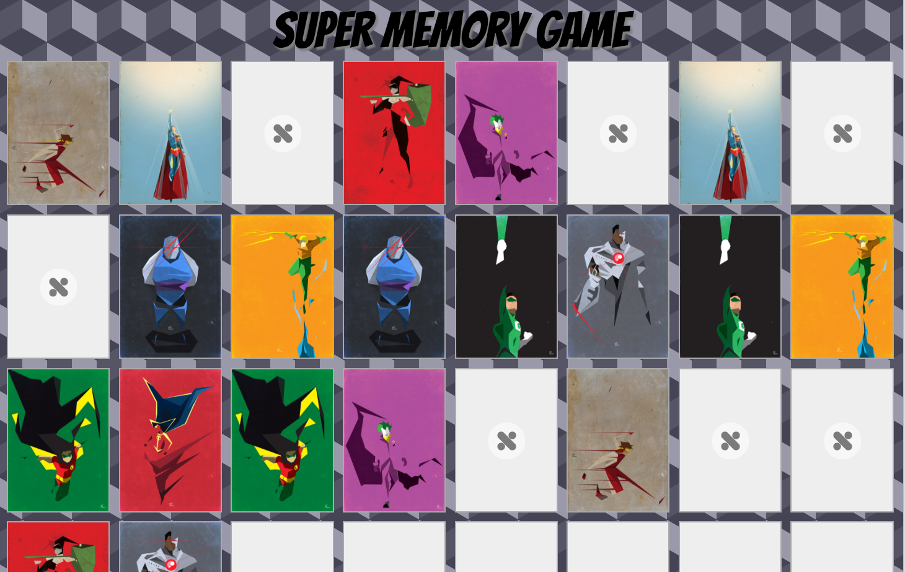

# superMEMORYGAME

# Screenshot

# Notes
For the first draft, I've designed the grid to hold the tiles using 
 and using "float: left" in the CSS.
Without "float: left" the images will stack on top each other.

Using float will arrange each image/tiles to the left of each other.

To give the images a cool flip/turn-over effect, CSS "transform" and z-index properties were one of distinguishing features.
http://css3.bradshawenterprises.com/flip/

Shoutout to colouronly85 of deviantart for the images. This is for educational purposes only.

# View
Play it [here](http://phamous2day.github.io/superMEMORYGAME/)

